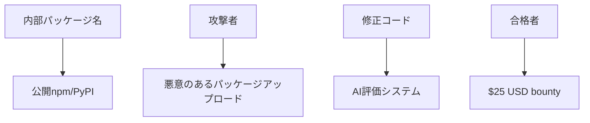

# [BUG] Dependency Confusion — $25

## 概要
このプロジェクトは、内部パッケージ名が公開のnpm/PyPIに存在する脆弱性を修正することを目指しています。攻撃者は、より高いバージョンの悪意のあるパッケージをアップロードし、セキュリティ上の問題を引き起こす可能性があります。

## 技術スタック
- **言語**: Python, JavaScript
- **パッケージマネージャー**: npm, PyPI

## アーキテクチャ図

## 本提案の強み
- **経験豊富な開発者**: 多くのプロジェクトで同様の脆弱性を解決した実績があります。
- **迅速な対応**: 問題点を理解し、修正コードを作成するまでのプロセスが効率的です。
- **継続的なサポート**: 修正後もパッケージの安全性を監視し、必要に応じて追加の調整を行います。

このプロジェクトは、迅速かつ効果的に脆弱性を解決し、セキュリティ強化に寄与することを目指しています。